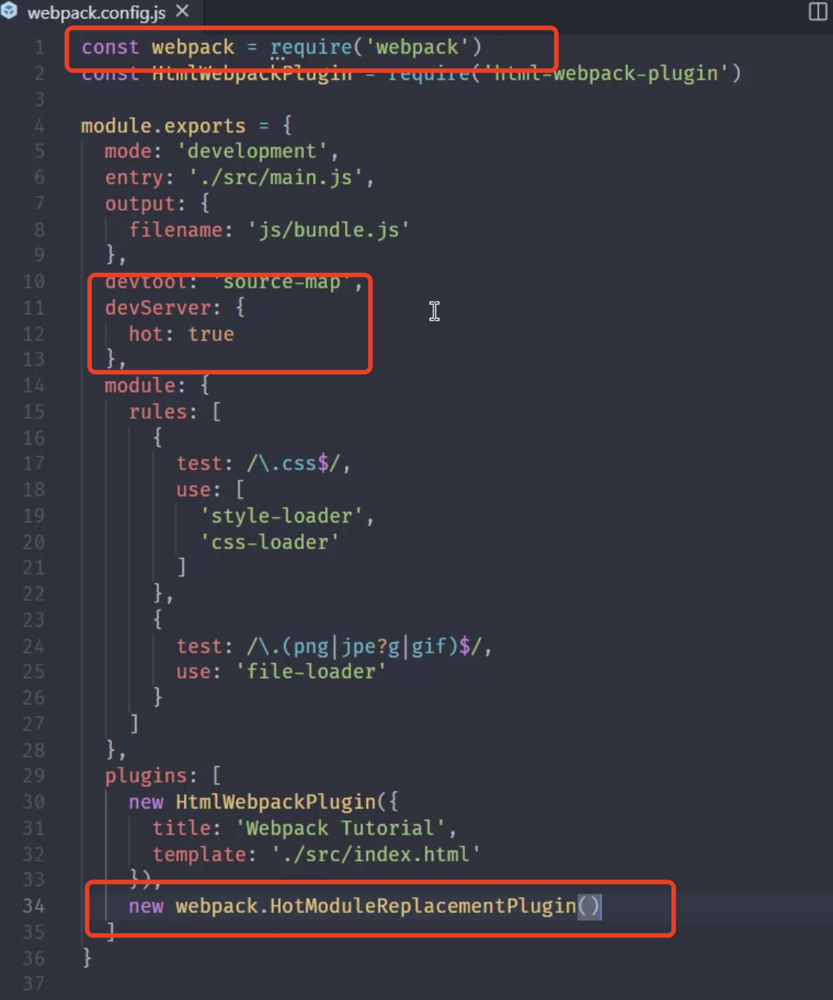

练习：https://github.com/Dream-Life/front-end/tree/master/modules

## 模块化

1. 模块化

   - 文件，对象，闭包来模块化

   - Commonjs是以同步模式加载模块，缺点：node环境下执行，只有用到的才会加载，而在浏览器上以同步加载，效率低下

   - AMD-Require.js异步加载模块，缺点：相对复杂，模块js请求频繁

   - CMD-Sea.js 异步加载模块

   - ESModule 异步加载模块

     - 自动采用严格模式，忽略'use strict'

       ```html
       <script type="module">
           console.log("这就是一个module~")
       </script>
       ```

     - this指向不是windows

     - 两个module都是私有的作用域，相互不干预

     - 通过CORS这种跨域方式请求外部js模块

       ```html
       // https://...需要支持CORS方式
       <script type="module" src="https://...."></script>
       ```

     - ESM的script标签会延迟执行

       ```html
       // 下面两个都是延迟执行，需要等html Dom都执行完才执行
       <script type="module" src="./demo.js"></script>
       <script defer src="./demo.js"></script>
       ```

2. ES Module导入导出注意

   - export {name} 不是 let obj = {name}，导出的时name的引用，不是变量对象，不是解构

   - import的值为只读

   - import一般只能在最顶部使用，如果需要动态加载

     ```javascript
     if(true){
         import('./module.js').then(function(module){
             console.log(module)
         })
     }
     ```

   - ```javascript
     // module.js
     export {name,age}
     export default "default export"
     
     // app.js
     import abc, {name,age} from './module.js'
     ```

3. Polyfill and browser-es-module-loader  解决IE等浏览器支持es6的兼容性问题，不过效率差

   ```html
   // nomodule 防止chrome代码运行两遍
   <script nomodule src="[CDN]"></script>
   ```

   

4. unpkg.com CDN网站

5. esm 在nodejs中的支持情况

   - 修改js后缀，改成mjs
   - 命令： node --experimental-modules index.mjs
   - 第三方直接import _ from "lodash",不能使用import {map} from "lodash"
   - nodejs内部方法对esm有支持，可以使用import {writeFileSync} from "fs"

6. esm 和 commonjs交互

   - esm调用commonjs

     esm import commonjs

     ```javascript
     // commonjs.js
     module.exports = {
         foo: "foo"
     }
     // esm.mjs
     import mod  from './commonjs.js'
     console.log(mod)
     
     // commonjs.js 只能这样传给esm.mjs
     // 下面这种交互会报错
     export.foo = 'foo'
     import {foo} from './commonjs.js'
     ```

     commonjs require esm

     ```javascript
     // 不支持
     ```

     

7. esm和commonjs在nodejs中的不同

   - requires是赋值，就是算copy；而import可以看成引用
   - require在运行中调用；import在编译时调用

   - 全局变量(其实这些都是形参，是伪全局对象)不同

     ```javascript
     // commonjs
     const {log} = console
     
     // 加载模块
     log(reuqire)
     
     // 模块对象
     log(module)
     
     // 导出对象别名
     log(exports)
     
     // 当前文件的绝对路径
     log(__filename)
     
     // 当前文件所在目录
     log(__dirname)
     ```

     ```javascript
     // esm in nodejs
     import {fileURLToPath} from 'url'
     import {dirname} from 'path'
     
     const {log} = console
     
     const __filename = fileURLToPath(import.meta.url)
     const __dirname = dirname(__filename)
     
     // require,module,exports 可以用 import和export 代替
     
     // 当前文件的绝对路径
     log(__filename)
     
     // 当前文件所在目录
     log(__dirname)
     ```

8. nodejs 12支持esm
   - 在package.json配置"type":"module"
   - 将esm的mjs后缀都改成js，将commonjs的js后缀改成cjs
   - 命令： node --experimental-modules index.js

9. babel
   - yarn add @babel/node @babel/core @babel/preset-env --dev
   - 命令：yarn babel-node index.js --presets=@babel/preset-env
   - .babelrc配置文件{"presets":["@babel/preset-env"]}
   - 命令：yarn babel-node index.js
   - 也可以不用@babel/preset-env 使用插件@babel/plugin-transform-modules-commonjs
   - .babelrc配置文件{"plugins":["@babel/plugin-transform-modules-commonjs"]}
   - 命令：yarn babel-node index.js

# webpack

1. webpack解决的问题：
   
   - esm模块化会导致模块文件过多，网络请求js什么的频繁，所有前端资源都需要模块化
   
2. 样式webpack编译css-loader和style-loader

3. file-loader 路径，output：{publicPath：'dist'}

4. url-loader  data:image/png;base64;....   options:{limit:10*1024} 超过10KB使用file-loader，低于10KB使用url-loader

5. webpack加载器loader：编译转换类；文件操作类；代码检查类；

6. babel-loader @babel/core @babel/preset-env

7. html-loader

8. webpack支持的加载方式

   - es module 的import
   - commonjs的require
   - AMD的define和require
   - 样式代码的@import和url函数
   - html代码中图片的src和a标签的href 

9. loader

   ```javascript
   module.exports = soure=>{
       // 代码
       return "[js代码]"
   }
   ```

10. webpack常用插件

    - clean-webpack-plugin 删除dist
    - html-webpack-plugin 生成index.html
    - copy-webpack-plugin

11. 自定义plugin

    


12. webpack自动编译：yarn webpack --watch

13. webpack-dev-server :{contentBase:['public']},静态资源访问

14. webpack-dev-server代理：{proxy:{}}

15. source map配置 devtool:"source-map"

16. devtool 模式对比

    

17. webpack devtool 开发环境：cheap-module-eval-source-map,线上环境：none/nosources-source-map

18. 模块热更新:页面中的状态不会丢失，只将修改的模块实时替换至应用

    - css热更新

    

- Js热更新
- 图片热更新

19. webpack HMR API

    

20. Webpack devServe:{hotOnly:true} 不会在模块热更新报错后，使用页面刷新

21. webpack 常用插件

    - webpack-merge

    - DefinePlugin //全局声明js

    - Tree Shaking //去掉不使用的代码

      - ```javascript
        optimization:{
          sideEffects: true, //没有用到的模块会被去掉
          usedExports:true,//标记不使用的代码
            concatenateModules:true, // 尽可能将模块合并，webpack3添加的
            minimize: true // 去除标记的代码
        } 
        ```

22. Tree Shaking webpack必须ESM，babel目前也支持ESM

23. webpack sideEffects

- 在package.json中需要配置sideEffects

24. 代码分割 chunks

- 多入口打包
  - 提取公共模块
- 动态导入模块
  - 

25. mini-css-extract-plugin 当css代码超过150kb，需要考虑使用这个插件将css文件 link到html，而不是css代码嵌入到html

26. webpack hash名-[hash],[chunkhash],[contenthash],其中[chunkhash]最适合解决缓存问题；[chunkhash:8]':8'可以指定hash的长度
27. TreeShaking在生产模式会自动开启，它是一组功能搭配使用后的效果，其中usedExports负责标记(枯树叶)，sideEffects一般用于npm包标记是否有副作用。
28. entry 是被打包文件的路径，可以是相对路径且./不能省略。output.path 可以是相对路径也可以是绝对路径

# rollup

- 适用于框架和类库，webpack适合应用开发
- rollup的优点
- - 

- rollup的缺点
  - 

1. Parcel

# ESLint

- eslint官网配置：https://eslint.bootcss.com/docs/user-guide/configuring

- 